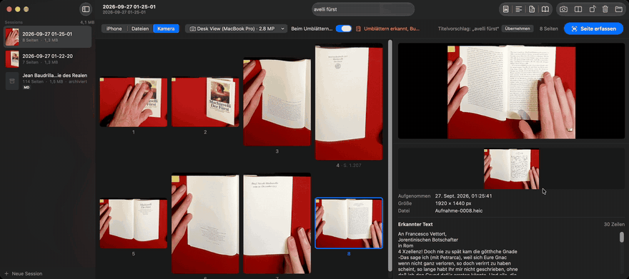

# Desk View Book Scanner

**Turn the page, and the text is done.** Lay the page down, the app captures it,
straightens it, splits the double page and recognizes the text in under a second,
before the next page is even down. At the end the book sits on disk as a searchable
PDF, Markdown, Word or EPUB, with paragraphs, headings and footnotes.

- **Fast.** iPhone scan at a keystroke, the page is on the Mac right away. With a
  camera above the book, turning the page is all it takes: auto capture takes every new
  page by itself.
- **Local.** macOS text recognition, German and English, no cloud, no account.
  Nothing leaves the Mac.
- **A book, not a pile of photos.** Continuous text across page boundaries, resolved
  hyphenation, page markers. Missing or duplicate pages are flagged while you scan.



In the video the images come from **Desk View**: a macOS feature that uses the camera
of the Mac, or of an iPhone clipped to the display, to look down at the desk. No stand,
no setup, the book simply lies in front of the keyboard. Its image is too coarse for
small body text, though; for that there is the iPhone scan or a 4K camera (see
[Tips](#tips-for-better-scans)).

Notes or Prizmo scan well too, but they do not give you a book with paragraph structure,
nor a session folder to come back to later.

Deutsche Fassung: [README.de.md](README.de.md).

## Quick start

```bash
./build_app.sh --run
```

1. Pick a source at the top of the window: iPhone, camera or files.
2. Scan: ⇧⌘S (iPhone), Space (camera), or switch on "Capture on page turn".
3. Export: ⌘E for PDF, ⇧⌘E for Markdown, Word and EPUB in the File menu.

Needs macOS 27 on Apple silicon; for the iPhone scan an iPhone on the same Apple ID
(Continuity Camera). Building: see [For developers](#for-developers).

### Download the app

[Releases](https://github.com/7hdmm9pp2w-code/desk-view-book-scanner/releases) have
the app as a ZIP. It is **not notarized**, since there is no paid Apple developer account
behind it, so macOS blocks it on first launch:

1. Unzip, drag the app into Applications and open it once. macOS says it cannot be
   opened.
2. System Settings → Privacy & Security → next to the message about the app, choose
   "Open Anyway" and confirm.

Or in Terminal: `xattr -dr com.apple.quarantine "/Applications/DeskViewBookScanner.app"`.
If you would rather not trust the prebuilt app, build it from source.

## How it works

1. **Capture.** Every page lands in the session right away, one folder per book. The
   app turns it upright and splits double pages at the gutter; text is recognized in
   the background, the cover provides the title suggestion.
2. **Check.** From the printed page numbers the app detects missing, duplicate and
   swapped pages and marks them with a triangle, with the camera also with a sound.
   Rescan blurry pages (⇧⌘R or the button on the thumbnail): old and new version side
   by side, the better recognized one is suggested.
3. **Export.**

| Format | What you get |
|---|---|
| PDF | page images with an invisible text layer, searchable and copyable in Preview |
| Markdown | continuous text with headings, footnotes, `<!-- Seite 12, Scan 10 -->` markers and flagged uncertain lines |
| Word, EPUB | the same text, for further writing or the e-reader |

## Tips for better scans

Most errors in the export do not come from text recognition but from too few pixels,
a curved gutter, or pages that give the app nothing to go by.

**The right source.** What counts is the line height in the image: from about 20 px
body text is reliable, below 12 px it is guesswork. Measured, not estimated:

| Source | Real resolution | Enough for |
|---|---|---|
| iPhone document scanner | about 1700 × 2700 per page | body text, the recommended way |
| 4K camera above the book (e.g. Insta360 Link) | 3840 × 2160 | body text, hands-free with auto capture |
| iPhone 4K video from above, imported afterwards | 3840 × 2160 | body text, hands-free; not yet measured on a book |
| Desk View (Mac or iPhone camera looking down), iPhone as a webcam | 1920 × 1440 | covers, headings, large print |

- **Desk View: book at the keyboard edge, trapezoid tight.** Desk View dewarps the edge
  of an ultra-wide image; the far side of the desk is the least sharp, and every bit of
  desk inside the trapezoid costs pixels on the book.
- **Cover and table of contents first.** The cover gives the title, the contents help
  recognize headings.
- **Keep page numbers in the image.** Without them there is no page order check and no
  page markers.
- **Press the book flat, hold it at the edges.** Lines lost in a curved gutter cannot be
  recovered. Hands at the edges do not disturb auto capture.
- **Hold still briefly after turning.** Auto capture waits for one and a half seconds of
  stillness. When first switched on, text recognition takes up to 25 s to load.
- **Film with the iPhone instead of taking photos.** Under Files, “Film a Book with the
  iPhone…” walks through it step by step. Through Continuity Camera the iPhone
  gives out at most 1920 × 1440, photos included (`scripts/probe_continuity_photo.swift`).
  In the Camera app it films 4K: iPhone above the book, 4K at 24 or 30 fps, turn page by
  page, keep filming briefly after the last one. AirDrop the video to the Mac and import
  it under Files (⇧⌘I); like auto capture, the app takes every new page after a turn.
  200 pages are about 7 minutes and 1 GB of video, which can go afterwards; reading it
  takes about a minute.
- **Light-colored books, spiral binding:** the gutter search can miss; choose Capture >
  Split Double Pages > "In the Middle" or "Don't Split".
- **Search the Markdown for `unsicher`.** Those are the candidates for a rescan.
  `scripts/ocr_stats.py` prints line height and confidence per page.

## Keyboard shortcuts

| | |
|---|---|
| ⇧⌘S | Scan with the iPhone |
| ⌥⌘S | Capture a page with the camera (Space in the page grid, too) |
| ⇧⌘I | Import images, PDF or video |
| ⇧⌘R | Rescan page |
| ⌘T, ⌘L, ⌘R | Split page, rotate left, rotate right |
| ⌘⌫, ⇧⌘Z | Delete page, restore the last deleted one |
| ⌘N, ⌘O | New session, open session folder |
| ⌘E, ⇧⌘E | Export as PDF, as Markdown |

## Where the data lives

Every session is a folder under `~/Documents/Buchscans/` (changeable in the settings):
pages as HEIC, recognized text as JSON next to them, order in `session.json`, deleted
pages in `Papierkorb/`. The sidebar lists all sessions; right-click to archive (images
go, text stays) or delete, always into the macOS Trash.

## For developers

A Swift package without an Xcode project; Xcode or the Command Line Tools are enough.

```bash
./build_app.sh --run
```

```bash
swift test
```

The build script signs with the Apple Development identity in your keychain (ad hoc
otherwise) and with the camera entitlement. The first build downloads Pandoc 3.11 (for
Word, EPUB and better Markdown) plus its source tarball into `build/vendor/` and
verifies the SHA-256; `--without-pandoc` builds without it.

- `BookScannerKit`: capture, session, OCR, rotating and splitting, structuring, export.
  No UI, fully tested.
- `DeskViewBookScanner`: the SwiftUI app.
- `scripts/`: Pandoc download, icon, OCR statistics, Continuity Camera photo size probe.

How the app decides internally (gutter search, auto capture, paragraphs and headings)
is described in German in the [concept](doc/KONZEPT.md) and the
[implementation log](doc/UMSETZUNG.md).

## License

[EUPL-1.2](LICENSE), official versions in all EU languages at
<https://joinup.ec.europa.eu/collection/eupl/eupl-text-eupl-12>.

The bundle ships [Pandoc](https://github.com/jgm/pandoc) (© John MacFarlane,
GPL-2.0-or-later) as a separate helper under `Contents/Helpers/pandoc`; the app is not a
derivative work. License text under `Contents/Resources/Lizenzen/`; the source of the
bundled version is attached to every release as `pandoc-<version>-src.tar.gz` (when
building, under `build/vendor/`).

## Thanks

Word, EPUB and the good Markdown come from [Pandoc](https://pandoc.org). Thanks to John
MacFarlane and everyone who works on Pandoc, for the tool and for letting others ship it
freely.
